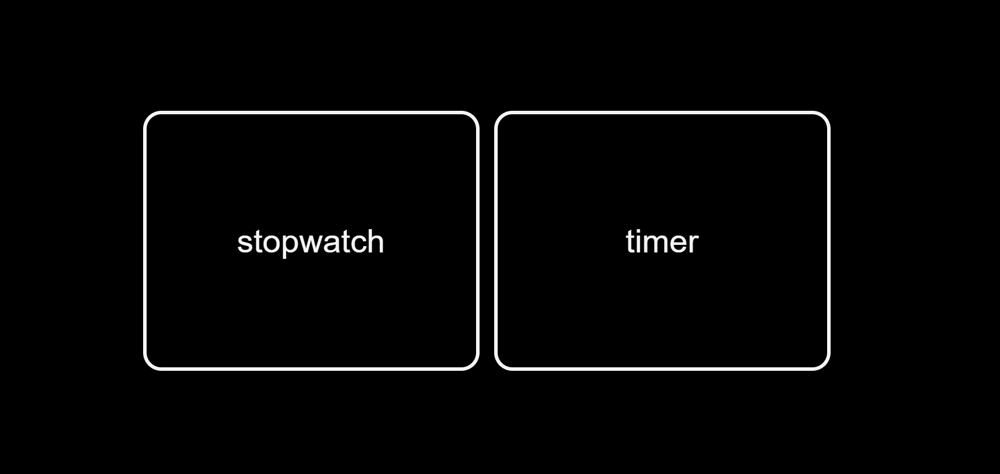
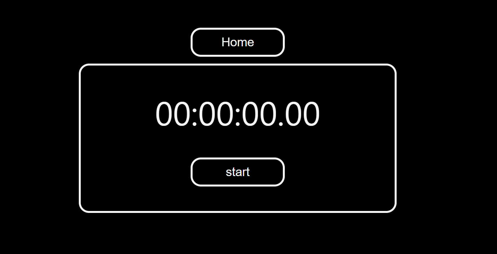
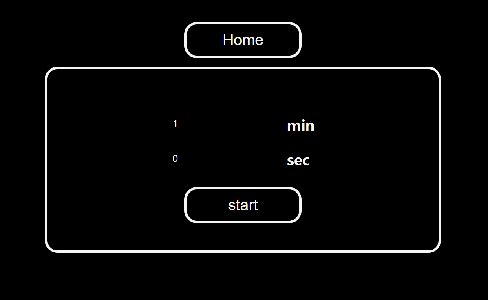
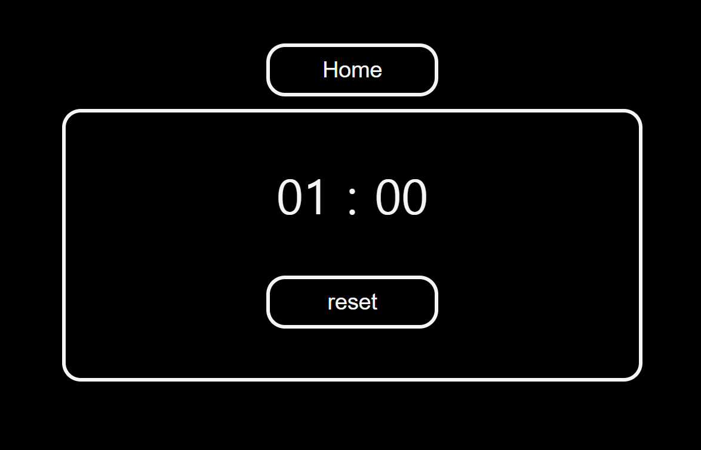

Stopwatch Online
================

리액트 학습을 위해 만들어본 온라인 스톱워치

https://kyw0716.github.io/Stopwatch-online

<br/>


-----

### Stopwatch online 웹은 App.js에서 BrowerRouter를 이용해 Home.js를 라우팅 시켜주면서 시작된다.

<br/>

## 1. Select

### Home.js에서는 selectPage라는 state를 통해 특정 조건을 만족 시 Select.js, Stopwatch.js, Timer.js 각각을 랜더링 해준다. 처음 갖고있는 selectPage의 디폴트 값은 Select.js를 랜더링 하도록 조건을 설정하였다.

<br/>

## 2. Stopwatch

### Stopwatch.js에서는 setInterval 함수를 사용하여 스톱워치를 작동 시켰다. <br/> 처음엔 timer 변수를 이용하여 setInterval 함수를 실행 시켰지만 다른 함수에서 clearInterval을 해주기 위해 timer 변수를 이용했을 때 스톱워치가 멈추지 않는 문제가 발생하게 되었다.

<br/> 

예시
```javascript
let timer = setInterval({
    stopwatchFunction();
}, time);

const end = () => {
    clearInterval(timer);
}
```

<br/> 

###  이를 해결하기 위해 interv라는 state를 만들어주어 setInterval 함수가 반환하는 값을 interv에 저장하였다. 이런 방식을 사용하면 다른 함수에서 clearInterval을 해주기 위해 setInterv 변수를 이용하여도 스톱워치가 정상적으로 멈추게 된다.

<br/> 


예시
```javascript
const [interv, setInterv] = useState();

const start = () => {
    setInterv(
        setInterval({
            stopwatchFunction();
        }, time)
    );
}

const end = () => {
    clearInterval(interv);
}
```

<br/>

## 3. Timer input

### Timer.js에서는 minute 값과 second 값을 각각의 state로 입력 받는다. 이를 이용해 앞서 Stopwatch.js 에서 설명한것과 같은 방식으로 setInterval 함수를 사용하여 timer를 작동시킨다. timer가 종료될 시 종료를 알리는 소리를 발생 시키기 위해 Audio 함수를 이용하였다. 

<br/>

예시
```javascript
let sound = new Audio('link');

sound.play();
//new Audio를 통해 생성된 소리가 sound 변수에 저장되고
//play()함수를 실행시 그 소리가 재생된다.
```

<br/>

### 아직 mp3형식의 파일을 재생 시키지 못하여 구글링을 통해 찾은 전자음을 반복 재생하는 방식으로 timer 종료음을 구현하였다. 이를 구현할 때 setTimeout 함수를 이용하였는데 소리간의 delay를 주는데 어려움이 발생하였다. ~~그냥 반복문을 통해 실행시키면 그냥 소리들이 한꺼번에 겹쳐서 재생되는 문제점이 발생하였다.~~ 이를 해결하기 위해 재귀함수를 사용하였다

<br/>

예시
```javascript
let sound = new Audio('link');
let i = 0;

const alarm = () => {
    sound.play();
    i++;
    setTimeout(alarm, time);
}
//이렇게 함수를 실행시키면 i를 통해 반복을 사용할 수 있게 되고,
//결과적으로 setTimeout함수를 이용한 delay도 사용할 수 있게 된다.
```

<br/>

## 4. Timer active

### Timer.js의 start 버튼을 눌렀을 시 실행되는 모습. reset 버튼을 클릭시 Timer.js의 첫 화면으로 돌아가게 된다.

<br/>

## Tech
개발에 사용된 언어 및 툴
* `javascript`, `react` : 반응형 웹페이지 제작을 위해 사용
* `html`, `css` : 웹 서비스의 기본 레이아웃 구성 및 디자인
* `JSX` : React 엘리먼트를 생성하면서 자바스크립트의 모든 기능을 쓸 수 있도록 보조해주기 위해 이용 
